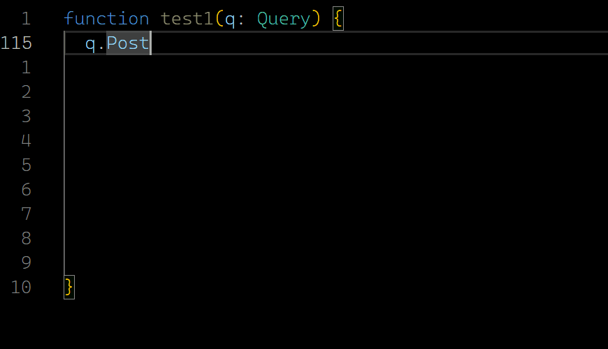

# my-query
这只是一个 Demo，功能是一个 TS 的 ORM 框架，并且能在前端应用查询。离可应用还差60%吧，直接看演示 >>>

> 库里面的测试都是没完善的，前端测试不过。后端只有20%的实现，不过思路我已经确定了。

## Where 筛选

### 筛选字段的条件
`Post` 是一个 entity，`where` 内可以使用一串链式调用，处理筛选条件，如 `id`, `titel`, `click_count` 进行筛选。
``` ts
function test1(q: Query) {
  q.Post.where(e => e
    .id.eq(3)
    .titel.startsWith("aaa")
    .click_count.gt(30))
```

<!--  -->


### AND OR 的筛选
`where` 默认 `AND` 为逻辑条件，也可以直接显式使用 `AND$` 或 `OR$` 指定逻辑条件，也可以多层嵌套。
``` ts
q.Post.where(e => e.AND$(e
  .id.eq(3)
  .titel.startsWith('dsd')
  .OR$(e
    .click_count.gt(30)
    .click_count.eq(10))))
```

<!--  -->


### 子对象（关联表）的过滤
Post 是主体，它的关联对象有 `author`, `comment`, `tag`。也可以对他们进行筛选。
``` ts
export interface Post {
  id: Id<Post>
  author_id: Id<User>
  titel: string
  content: string
  create_at: Date
  update_at: Date
  delete_at?: Date
  is_archive: boolean
  click_count: number

  author: User
  comment: Comment[]
  tags: Tag[]
}

export interface Comment {
  id: Id<Comment>
  user_id: Id<User>
  post_id: Id<Post>
  content: string
  create_at: Date
  delete_at: Date

  user: User
}
```
``` ts
  q.Post.where(e => e
    .create_at.gt('2024-1-1') // 文章创建大于 2024-1-1
    .comment(c => c  // left join comment
      .create_at.gt('2024-3-1') // 评论创建大于 2024-3-1
      .user(u => u.name.startsWith("A")) // 评论者的昵称以 A 开头
    ))
```

### 安全类型的覆盖
强类型的参数，直接再编译期就报错了，还有对一些类型特化如 `date`, `boolean`。
``` ts
q.Post.where(p => p
  .id.eq("ds") // error: 'string' is not assignable to parameter of type 'Id<Post> | Op'.
  .id.eq(2222) // ok
  .titel.eq(22222) // error: 'number' is not assignable to parameter of type 'string | Op'
  .titel.eq("aaa") // ok
  .create_at.gt("NOW") // 字面量类型 NOW，指定当前时间
  .is_archive.isFalse() // 直接指定 is_archive == false
)
```

## Select 选择
也是一串链式调用，并且能引用到子对象（关联表）的选择，是不是有点 `GraphQL` 的味道了 ~~（并没有，差远了）~~。
``` ts
q.Post.select(p => p
  .id.titel.content.click_count.create_at // 文章的内容信息
  .author(a => a.name) // 文章作者信息
  .comment(c => c.id.content.create_at // 评论信息
    .user(u => u.id.name)) // 评论者信息
  .tags(t => t.name)) // 文章的标签 Tag
```
<!--  -->


> 其实我是考虑过有 `Include` 包含子对象查询的，后来发现直接写在 `select` 里面更简单，更优雅 （~~EF 误导我~~）。更早的版本，我甚至也允许进行 `left join`, `inner join` 的查询，后来发现这也过于复杂了，而且这个表关系应该直接交给后端配置，前端写关系查询要么写对，要么写错。还不如让后端一次配置就完成了，不用每个查询都写关联关系。

## OrderBy 排序
支持指定 `DESC` 和 `ASC`。
``` ts
q.Post.orderBy(p => p
  .create_at.DESC$.update_at.titel)
```
<!--  -->


## 应用
项目可以应用在前端，这一连串的查询可以生成一些查询结构，这个结构不是 sql 语句，而是类似一种 AST 的数据结构。这个结构发送给后端，后端把这个结构生成 sql 语句进行查询，然后再返回给前端。

当然后端需要处理查询表的**白名单**，**身份验证**，**表关系的建立**。一些字段是不可以查询的，还要防止注入。基本安全做好了之后，前端发给的 AST 数据结构是一个 json 字符串，可以根据这个做一个缓存，不用每次把 AST 都生成 sql。

如果是像 nodejs 用 TS 做后端，那么后端的安全性就不用管防注入了，已经自己处理生成 sql 了。

> 题外话，我尝试使用 Rust 做后端的生成，一个是 Rust 的类型系统比较方便处理 Tagged Union 类型，还有元组，如果用 C# 那么 Union 类型没有，元组也不好用，反序列化都是个麻烦，用面向对象来写更累了；另一个原因是拿 Rust 来练手，当玩具来写，随便写写。

---

（2024-3-10，再续……）
